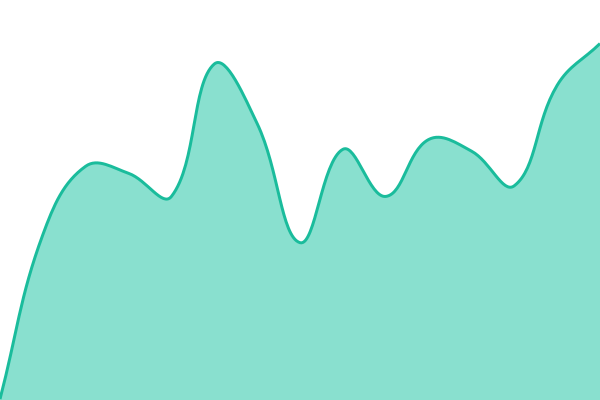
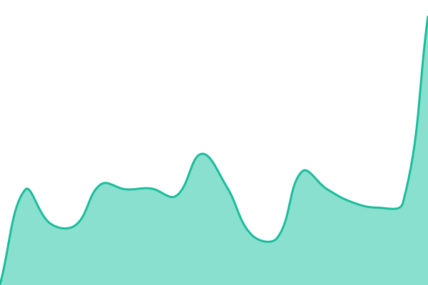
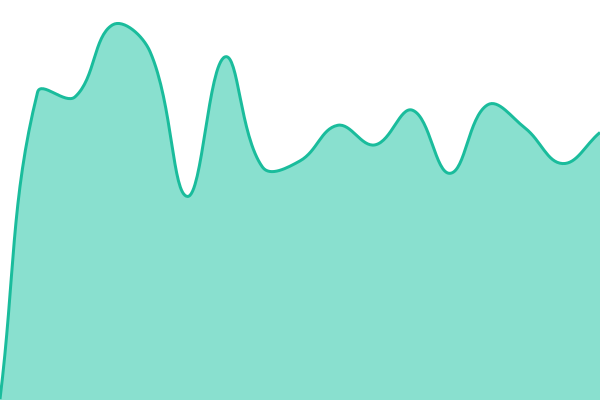

# [📈 Live Status](https://status.sakneen.com): <!--live status--> **All Systems Operational**

  
  <h3>Sakneen System Status & Performance Monitor</h3>
  
Real-time monitoring of Sakneen's services and infrastructure

This repository contains the open-source uptime monitor and status page for [Sakneen](https://www.sakneen.com), powered by [Upptime](https://github.com/upptime/upptime).

## 🚀 Quick Links

- **[📊 Live Status Page](https://status.sakneen.com)** - View current system status
- **[📈 Historical Data](https://status.sakneen.com/history)** - View uptime history and performance trends
- **[🚨 Incident Reports](https://github.com/Sakneen/uptime-status/issues)** - View and track incidents

## 📊 Current Status

## 🛠️ Monitored Services

Our monitoring system tracks the following services across production and development environments:

- **Backend Services** - Core API and backend infrastructure
- **SaaS Platform** - Software-as-a-Service platform
- **Management Portal** - Administrative and management interfaces

With [Upptime](https://upptime.js.org), you can get your own unlimited and free uptime monitor and status page, powered entirely by a GitHub repository. We use [Issues](https://github.com/Sakneen/uptime-status/issues) as incident reports, [Actions](https://github.com/Sakneen/uptime-status/actions) as uptime monitors, and [Pages](https://status.sakneen.com) for the status page.

<!--start: status pages-->
<!-- This summary is generated by Upptime (https://github.com/upptime/upptime) -->
<!-- Do not edit this manually, your changes will be overwritten -->
<!-- prettier-ignore -->
| URL | Status | History | Response Time | Uptime |
| --- | ------ | ------- | ------------- | ------ |
|  [API Health](https://app.sakneen.com/sakneen/apis/v1/health) | Up | [api-health.yml](https://github.com/Sakneen/uptime-status/commits/HEAD/history/api-health.yml) | 

 262ms
     
 | 

<a href="https://status.sakneen.com/history/api-health">100.00%</a>
    

|  [API Integrations](https://app.sakneen.com/external/apis/v1.0/healthz) | Up | [api-integrations.yml](https://github.com/Sakneen/uptime-status/commits/HEAD/history/api-integrations.yml) | 

 194ms
     
 | 

<a href="https://status.sakneen.com/history/api-integrations">100.00%</a>
    

|  [Sales](https://health.sakneen.com/api/health) | Up | [sales.yml](https://github.com/Sakneen/uptime-status/commits/HEAD/history/sales.yml) | 

 279ms
     
 | 

<a href="https://status.sakneen.com/history/sales">100.00%</a>
    

|  [Dashboard](https://health.manage.sakneen.com/api/health) | Up | [dashboard.yml](https://github.com/Sakneen/uptime-status/commits/HEAD/history/dashboard.yml) | 

 286ms
     
 | 

<a href="https://status.sakneen.com/history/dashboard">100.00%</a>
    

|  [Ecommerce](https://health.ecommerce.sakneen.com/api/health) | Up | [ecommerce.yml](https://github.com/Sakneen/uptime-status/commits/HEAD/history/ecommerce.yml) | 

 320ms
     
 | 

<a href="https://status.sakneen.com/history/ecommerce">100.00%</a>
    

<!--end: status pages-->

[**Visit our status website →**](https://status.sakneen.com)

## 🔍 Monitoring Details

### 📊 What We Monitor

- **Uptime**: Continuous monitoring every 30 minutes
- **Response Time**: Average, 24h, 7d, 30d, and 1-year metrics
- **Status Codes**: HTTP response validation (200 OK)
- **Performance**: Response time trends and graphs

### 🚨 Incident Management

- **Automatic Detection**: Issues are automatically created when services go down
- **Real-time Updates**: Status page updates in real-time
- **Historical Data**: Complete incident history and resolution tracking
- **Email Notifications**: Professional alerts sent to operations team
- **Slack Integration**: Real-time alerts to Slack channels for immediate response

### 📈 Performance Metrics

- **SLA Targets**: 99.9% uptime goal for production services
- **Response Time Goals**:
  - Production services: < 1000ms
  - Development services: < 2000ms
- **Monitoring Frequency**: Every 30 minutes
- **Data Retention**: Historical data preserved indefinitely

## 🔧 Technical Details

### Architecture

- **Platform**: [Upptime](https://upptime.js.org) - Open source uptime monitor
- **Hosting**: GitHub Pages with custom domain (status.sakneen.com)
- **Automation**: GitHub Actions for monitoring and updates
- **Data Storage**: Git-based historical data storage

### Configuration

- **Configuration File**: `.upptimerc.yml`
- **Monitoring Schedule**: Every 30 minutes via GitHub Actions
- **Status Website**: Auto-generated and deployed to status.sakneen.com
- **Notifications**: Email and Slack alerts with professional templates

## 🤝 Contributing

### Reporting Issues

If you notice any issues with our services:

1. Check the [status page](https://status.sakneen.com) first
2. Look for existing [issues](https://github.com/Sakneen/uptime-status/issues)
3. Create a new issue using our templates if needed

### Monitoring Requests

To request monitoring of new services, please open an issue with:

- Service URL
- Expected status codes
- Service description
- Priority level

## 📞 Contact & Support

- **Status Page**: [status.sakneen.com](https://status.sakneen.com)
- **Main Website**: [www.sakneen.com](https://www.sakneen.com)
- **GitHub Issues**: [Report Issues](https://github.com/Sakneen/uptime-status/issues)
- **Slack Setup**: [Configure Slack Notifications](./docs/SLACK_SETUP.md)
- **Email Support**: support@sakneen.com
- **Security**: [Security Policy](.github/SECURITY.md)

## 📄 License

- **Monitoring Platform**: [Upptime](https://github.com/upptime/upptime) - MIT License
- **Original Code**: © [Anand Chowdhary](https://anandchowdhary.com), supported by [Pabio](https://pabio.com)
- **Customizations**: © 2025 Sakneen
- **Status Data**: Available under [Open Database License](https://opendatacommons.org/licenses/odbl/1-0/)

- Powered by: [Upptime](https://github.com/upptime/upptime)
- Code: [MIT](./LICENSE) © [Anand Chowdhary](https://anandchowdhary.com), supported by [Pabio](https://pabio.com)
- Data in the `./history` directory: [Open Database License](https://opendatacommons.org/licenses/odbl/1-0/)
