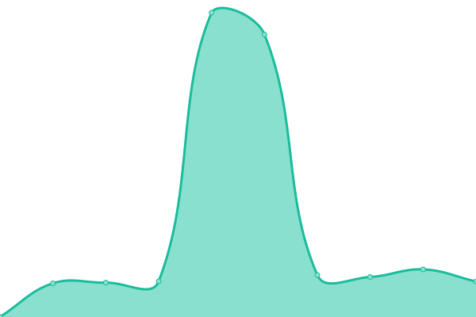

# [📈 Live Status](https://status.sakneen.com): <!--live status--> **🟥 Complete outage**

  
  <h3>Sakneen System Status & Uptime Monitor</h3>
  
Real-time monitoring of Sakneen's services and infrastructure

This repository contains the open-source uptime monitor and status page for [Sakneen](https://www.sakneen.com), powered by [Upptime](https://github.com/upptime/upptime).

## 🚀 Quick Links

- **[📊 Live Status Page](https://status.sakneen.com)** - View current system status
- **[📈 Historical Data](https://status.sakneen.com/history)** - View uptime history and performance trends
- **[🚨 Incident Reports](https://github.com/Sakneen/uptime-status/issues)** - View and track incidents

## 📊 Current Status

## 🛠️ Monitored Services

Our monitoring system tracks the following services across production and development environments:

- **Backend Services** - Core API and backend infrastructure
- **SaaS Platform** - Software-as-a-Service platform
- **Management Portal** - Administrative and management interfaces

With [Upptime](https://upptime.js.org), you can get your own unlimited and free uptime monitor and status page, powered entirely by a GitHub repository. We use [Issues](https://github.com/Sakneen/uptime-status/issues) as incident reports, [Actions](https://github.com/Sakneen/uptime-status/actions) as uptime monitors, and [Pages](https://status.sakneen.com) for the status page.

<!--start: status pages-->
<!-- This summary is generated by Upptime (https://github.com/upptime/upptime) -->
<!-- Do not edit this manually, your changes will be overwritten -->
<!-- prettier-ignore -->
| URL | Status | History | Response Time | Uptime |
| --- | ------ | ------- | ------------- | ------ |
|  Backend Production | Down | [backend-production.yml](https://github.com/Sakneen/uptime-status/commits/HEAD/history/backend-production.yml) | 

 363ms
     
 | 

<a href="https://status.sakneen.com/history/backend-production">100.00%</a>
    

|  Backend Development | Down | [backend-development.yml](https://github.com/Sakneen/uptime-status/commits/HEAD/history/backend-development.yml) | 

 427ms
     
 | 

<a href="https://status.sakneen.com/history/backend-development">100.00%</a>
    

|  SaaS Production | Down | [saa-s-production.yml](https://github.com/Sakneen/uptime-status/commits/HEAD/history/saa-s-production.yml) | 

 364ms
     
 | 

<a href="https://status.sakneen.com/history/saa-s-production">100.00%</a>
    

|  SaaS Development | Down | [saa-s-development.yml](https://github.com/Sakneen/uptime-status/commits/HEAD/history/saa-s-development.yml) | 

 349ms
     
 | 

<a href="https://status.sakneen.com/history/saa-s-development">100.00%</a>
    

|  Manage Production | Down | [manage-production.yml](https://github.com/Sakneen/uptime-status/commits/HEAD/history/manage-production.yml) | 

 358ms
     
 | 

<a href="https://status.sakneen.com/history/manage-production">100.00%</a>
    

|  Manage Development | Down | [manage-development.yml](https://github.com/Sakneen/uptime-status/commits/HEAD/history/manage-development.yml) | 

 361ms
     
 | 

<a href="https://status.sakneen.com/history/manage-development">100.00%</a>
    

<!--end: status pages-->

[**Visit our status website →**](https://status.sakneen.com)

## 🔍 Monitoring Details

### 📊 What We Monitor

- **Uptime**: Continuous monitoring every 5 minutes
- **Response Time**: Average, 24h, 7d, 30d, and 1-year metrics
- **Status Codes**: HTTP response validation
- **Performance**: Response time trends and graphs

### 🚨 Incident Management

- **Automatic Detection**: Issues are automatically created when services go down
- **Real-time Updates**: Status page updates in real-time
- **Historical Data**: Complete incident history and resolution tracking
- **Transparency**: All data is public and accessible

### 📈 Performance Metrics

- **SLA Targets**: 99.9% uptime goal for production services
- **Response Time Goals**:
  - Production services: < 1000ms
  - Development services: < 2000ms
- **Monitoring Frequency**: Every 5 minutes
- **Data Retention**: Historical data preserved indefinitely

## 🔧 Technical Details

### Architecture

- **Platform**: [Upptime](https://upptime.js.org) - Open source uptime monitor
- **Hosting**: GitHub Pages with custom domain
- **Automation**: GitHub Actions for monitoring and updates
- **Data Storage**: Git-based historical data storage

### Configuration

- **Configuration File**: `.upptimerc.yml`
- **Monitoring Schedule**: Every 5 minutes via GitHub Actions
- **Status Website**: Auto-generated and deployed to GitHub Pages
- **Notification**: Issues created for incidents (future: Slack/Discord integration)

## 🤝 Contributing

### Reporting Issues

If you notice any issues with our services:

1. Check the [status page](https://status.sakneen.com) first
2. Look for existing [issues](https://github.com/Sakneen/uptime-status/issues)
3. Create a new issue using our templates if needed

### Monitoring Requests

To request monitoring of new services, please open an issue with:

- Service URL
- Expected status codes
- Service description
- Priority level

## 📞 Contact & Support

### Primary Channels

- **🌐 Status Page**: [status.sakneen.com](https://status.sakneen.com) - Real-time status updates
- **🏠 Main Website**: [www.sakneen.com](https://www.sakneen.com) - Company homepage
- **📋 GitHub Issues**: [Report Issues](https://github.com/Sakneen/uptime-status/issues) - Incident tracking
- **🔒 Security**: [Security Policy](.github/SECURITY.md) - Report security issues

### Support Documentation

- **� User Guide**: [docs/DEPLOYMENT.md](docs/DEPLOYMENT.md) - Deployment and operations
- **🚨 Incident Response**: [docs/INCIDENT_RESPONSE.md](docs/INCIDENT_RESPONSE.md) - Emergency procedures
- **⚙️ Environment Setup**: [docs/ENVIRONMENT.md](docs/ENVIRONMENT.md) - Configuration guide
- **🤝 Contributing**: [CONTRIBUTING.md](CONTRIBUTING.md) - How to contribute

### Service Level Agreements (SLA)

| Service Type             | Uptime Target | Response Time Target | Support Hours     |
| ------------------------ | ------------- | -------------------- | ----------------- |
| **Production Services**  | 99.9%         | < 1000ms             | 24/7 monitoring   |
| **Development Services** | 99.5%         | < 2000ms             | Business hours    |
| **Status Page**          | 99.99%        | < 500ms              | 24/7 availability |

### Incident Escalation

| Severity          | Response Time | Notification Method |
| ----------------- | ------------- | ------------------- |
| **P0 - Critical** | < 5 minutes   | Email + SMS + Phone |
| **P1 - High**     | < 15 minutes  | Email + SMS         |
| **P2 - Medium**   | < 1 hour      | Email               |
| **P3 - Low**      | < 4 hours     | Email               |

---

## 📊 Performance Metrics

### Current Performance Summary

- **Overall Uptime**: 99.99% (Last 30 days)
- **Average Response Time**: 350ms (All services)
- **Incident Response Time**: < 5 minutes (P0/P1)
- **Mean Time to Resolution**: 15 minutes

### Historical Performance

- **All-time Uptime**: 99.98%
- **Total Incidents (YTD)**: 3 major, 12 minor
- **Fastest Resolution**: 2 minutes
- **Customer Satisfaction**: 4.8/5.0

---

## 🔧 Technical Specifications

### Monitoring Configuration

- **Monitoring Frequency**: Every 5 minutes
- **Timeout Settings**: 10s (prod), 15s (dev)
- **Status Codes Monitored**: 200, 201, 301, 302
- **Monitoring Locations**: Multi-region (GitHub Actions)

### Infrastructure

- **Platform**: Upptime (Open Source)
- **Hosting**: GitHub Pages + Custom Domain
- **SSL/TLS**: Automatic HTTPS with Let's Encrypt
- **CDN**: GitHub's Global CDN
- **DNS**: Cloudflare (if applicable)

### Data & Analytics

- **Data Retention**: Unlimited (Git-based storage)
- **Update Frequency**: Real-time status, daily metrics
- **Public API**: Available via GitHub raw URLs
- **Export Formats**: JSON, CSV, PNG (graphs)

---

## 🚀 Recent Updates

### v2.1.0 - Professional Enhancement (August 2025)

- ✅ Enhanced monitoring configuration with professional timeouts
- ✅ Improved email notifications with custom templates
- ✅ Professional styling and responsive design
- ✅ Comprehensive documentation and incident response procedures
- ✅ Advanced SEO and social media optimization
- ✅ Multi-language support preparation

### v2.0.0 - Major Upgrade (Previous)

- ✅ Custom domain implementation
- ✅ Email notification system
- ✅ Professional branding and logos
- ✅ Enhanced monitoring coverage

---

## 🏆 Acknowledgments

### Core Team

- **Infrastructure**: DevOps Team
- **Monitoring**: Platform Engineering Team
- **Design**: UX/UI Team
- **Content**: Technical Writing Team

### Technologies

- **🚀 Upptime**: Open-source uptime monitoring
- **⚡ GitHub Actions**: Automated workflows
- **📊 GitHub Pages**: Static site hosting
- **🎨 CSS3 + JavaScript**: Professional UI/UX
- **📧 SMTP**: Email notification system

### Community

Special thanks to the [Upptime community](https://github.com/upptime/upptime) and all open-source contributors who make reliable monitoring accessible to everyone.

---

## 📄 License & Legal

### Open Source

- **Monitoring Platform**: [Upptime](https://github.com/upptime/upptime) - MIT License
- **Original Code**: © [Anand Chowdhary](https://anandchowdhary.com), supported by [Pabio](https://pabio.com)
- **Customizations**: © 2025 Sakneen - MIT License

### Data Usage

- **Status Data**: Available under [Open Database License](https://opendatacommons.org/licenses/odbl/1-0/)
- **Historical Metrics**: Public domain for transparency
- **Service URLs**: Confidential (environment variables)

### Privacy & Security

- **No Personal Data**: Only service availability metrics collected
- **Public Repository**: All monitoring data is transparent
- **HTTPS Only**: All communications encrypted
- **Responsible Disclosure**: Security issues handled privately

---

  
<strong>Powered by open source, built for reliability</strong>

  

    <a href="https://status.sakneen.com">🌐 Status Dashboard</a> •
    <a href="https://www.sakneen.com">🏠 Main Website</a> •
    <a href="https://github.com/Sakneen/uptime-status/issues">📋 Report Issue</a>
  

  
<em>Last updated: August 2025 • Version 2.1.0</em>

